> 计网复习整理
>
> Author: Xu Chenyu && DarkDawn

# 第一章 概述

## 1.1 计算机网络概述

### 1.1.1 计算机网络

- 定义：指实现计算机之间通讯的软件和硬件系统的统称。

  *interconnected collection of autonomous computers connected by a communication technology*

- 分布式系统：存在一个能为用户自动管理资源的网络操作系统，由它调用完成用户任务所需要的资源，对用户是透明的。

  分布式系统是在网络之上构建的软件系统；

  网络与分布式系统之间的区别在于软件上，而不是硬件上。

### 1.1.2 计算机网络的功能

- 互联 interconnection  互通 intercommunication  互操作 interoperation
- 资源共享 + 数据通信

### 1.1.3 计算机网络的分类

- 按传输技术划分
  - 广播式
  - 点到点
- 按地理距离划分（网络尺度）
  - 局域网LAN 10m~1km
    - 广播技术
    - 拓扑结构：总线型bus，环形ring，星形star，树状拓扑tree
    - 无线局域网：接入点AP / 无线路由器 / 基站 e.g. WiFi
    - 有线局域网：拓扑结构以点到点链路为基础 e.g.以太网
  - 城域网MAN 10km~100km
  - 广域网WAN 1000km~10000km
    - 拓扑结构：分布式，网状

### 1.1.4 计算机网络的组成

#### （1）计算机网络的组成元素分成两大类

- 网络结点

- 通信链路

#### （2）功能组成

- 通信子网：实现网络通信功能的设备及其软件的集合

- 资源子网：网络中实现资源共享功能的设备及其软件的集合

#### （3）物理组成

- 计算机、传输介质、网络连接设备、网络软件

## 1.2 互联网Internet

### 1.2.1 网络的网络

- 互联网：不是单一网络，是网络和网络的网络，是在互联网上运行的分布式系统。

### 1.2.2 用路由器互连的网络的集合

### 1.2.3 组成

- 主机host（端系统）：运行网络应用程序
- 通信链路 / 传输线路：负责在机器之间移动比特 e.g. 光线、铜线、卫星
  - 传输速率 = 带宽
- 路由器（交换机）：转发分组

### 1.2.4 从Internet的工作方式上看：

#### （1）边缘部分edge -- 端系统end system

- 端到端通信
  - 客户/服务器模型 client/server
    - 客户：向服务器提出请求，得到服务
    - 服务器：共享资源的拥有者，响应客户的请求、进行处理，提供服务
    - 工作过程：客户机进程通过网络将一个消息发送给服务器进程，然后客户机进程等待应答消息；当服务器进程获得了该请求消息后，执行客户所请求的工作，或者查询客户所请求的数据，然后发回一个应答消息
  - 对等连接工作方式 peer-to-peer

#### （2）核心部分core -- 路由器router

- 路由器是实现**分组交换packet switching**的关键构件，其任务是转发收到的分组，这是网络核心部分最重要的功能
- 交换：
  - **电路交换circuit switching**
    - 发送数据之前需要建立一条端到端的路径
    - 一旦完成连接的建立，数据传输的唯一延迟是电磁信号的传播时间
  - **分组交换/包交换 packet switching**
    - 存储-转发传输技术
    - 与电路交换不同
      - 电路交换中连接的建立过程预留了从发送端到接收端一路上的带宽资源，该条电路上的所有数据将走相同的路径。让所有数据遵循同样的路径意味着他们到达接收端的**秩序**不会出现混乱；而在数据包交换中，没有固定的路径，不同的数据包可以走不同的路径，路径选择取决于它们被传输时的网络状况，因而到达接收端的秩序可能出现混乱。
      - 电路交换中**拥塞**发生在建立电路时，数据包交换中拥塞发生在转发数据包时

### 1.2.5 接入和物理介质

#### 各种接入网络

* xDSL：x数字用户线
* HFC：混合光纤同轴电缆
* FTTx：光纤接入
* LAN：局域网
* Wireless：无线

#### 多种物理介质

* 双绞线（UTP/STP）
* 同轴电缆
* 光纤
* 无线

### 1.2.6 传输技术

#### （1）广播式链路broadcasting

- 无线网络
- 如果被传输的数据包带有某种特殊的地址编码，那么网络中的每一台机器都将会接受该包并对其进行处理。

#### （2）点到点链路 point-to-point【单播unicasting】

- 点到点链路将一对单独的机器连接起来。在一个由点到点链路组成的网络中，为了从源端到达接收方，短消息必须首先访问一个或多个中间机器，这种短消息在某些情况下称为**数据包packet**

#### （3）组播multicasting

- 有些广播系统还支持给一组机器发送数据包的模式

### 1.2.7 Internet结构：三个阶段

- 第一阶段：从单个网络ARPANET向互联网发展的过程
- 第二阶段：建立了三级结构的因特网。形成三级计算机网络：主干网、地区网和校园网（企业网）
- 第三阶段：逐渐形成了多层次ISP结构，出现了因特网服务提供者**ISP（Internet服务提供商）**

### 1.2.8 Internet标准化

- 因特网草案Internet Draft。在这个阶段还不是RFC文档
- 建议标准proposed standard。从这个阶段开始就成为RFC文档
- 草案标准Draft Standard
- 因特网标准Internet Standard

## 1.3 计算机网络的性能

### 1.3.1 速率data rate

- 数据率/比特率，计网中最重要的性能指标
- 单位b/s(bps)或kb/s，Mb/s，Gb/s

### 1.3.2 带宽bandwidth

- 模拟带宽：信号具有的频带宽度（Hz）

  - 指信道允许通过信号频率的范围，传输信道的最高频率和最低频率之差

    *标准电话话路带宽300~3400 Hz(3100 Hz)，理想情况下为2400 Hz*

- 数字带宽：信道的最大数据速率（bps，比特每秒）

  - **奈奎斯特**：如果任意一个信号通过了一个**带宽为B**Hz的低通滤波器，那么只要进行**每秒2B次采样**，就可以完全重构出被过滤的信号。由于通过样值能恢复出来的高频成分已经被滤掉了，所以**高于每秒2B次的采样毫无意义**。如果信号包含了**V个离散等级**（e.g. 二进制信号为两级），**奈奎斯特定理：**
    $$
    最大数据速率 = 2B\log_{2}V (bps)
    $$
    *e.g. 编码解码器每秒采集8000个样值，这个采样率足以捕捉一切来自4 kHz电话信道带宽上的信息*

  - **香农**：对于一条**带宽为B** Hz，**噪声比是S/N**的有噪声信道，其最大数据速率或者容量是
    $$
    最大比特率 = B\log_{2}(1+S/N) （bps）
    $$

    - 信噪比S/N = 信号功率S / 噪声功率N，通常表示成对数的形式10log10S/N，单位为分贝dB 

      *e.g 10的信噪比为10分贝，100的信噪比为20分贝，1000的信噪比为30分贝*

### 1.3.3 吞吐量throughput

- 单位时间内通过某个网络（或信道、接口）的数据量
- 受网络的带宽或网络的额定速率的限制

### 1.3.4 时延delay / latency

>  电路交换与分组交换中4种延迟的分析计算

- 传输时延（发送时延）：发送数据时，数据块从结点进入到传输媒体所需要的时间
- 传播时延：电磁波在信道中需要传播一定的距离而花费的时间
- 处理时延：交换结点为存储转发而进行一些必要的处理所花费的时间
- 排队时延：结点缓存队列中分组排队所经历的时延，其长短往往取决于网络中当时的通信量

### 1.3.5 时延带宽积

- 链路的时延带宽积又称为以比特为单位的链路长度

### 1.3.6 利用率

> 信道利用率的计算

- 信道利用率：某信道有百分之几的时间是被利用的（有数据通过），完全空闲的信道的利用率为0
  - 并非越高越好
- 网络利用率：全网络信道利用率的加权平均值

## 1.4 计算机网络体系结构

### 1.4.1 协议

- 指通信双方就如何进行通信的一种约定
- 三要素：
  - 语法：数据与控制信息的结构或格式
  - 语义：需要发出何种控制信息，完成何种动作以及做出何种响应
  - 同步：事件实现顺序的详细说明

### 1.4.2 协议层次

- 协议是分层实现的，每层独立完成一部分通信功能
  - 每层功能的实现都需要借助下层的服务来完成，同时向上层提供更高级的
  - 通信只在相邻层之间进行，不允许跨层调用

### 1.4.3 服务

- 下层为上层提供的通信支持
- 两种类型
  - 面向连接的服务connection-oriented service【可靠】：
    - 按照电话系统建模
    - 为了使用面向连接的网络服务，服务用户首先必须建立一个连接，然后使用该连接传输数据，最后释放连接；数据位保持原来的顺序，所有数据位都会按照发送的顺序到达
    - **虚电路circuit服务**
  - 无连接的服务connectionless service【不可靠(意味着没有被确认)】：
    - 按照邮政系统建模
    - 每个**报文message**（信件）都携带了完整的目标地址，每个报文都由系统中的中间节点路由，而且路由独立于后续报文。
    - 报文在不同的上下文中有不同的称呼，数据包/包packet是网络层的报文
    - **数据报服务datagram service**
    - **存储-转发交换 cut-through switching**：中间节点只能在收到报文的全部内容之后再将该报文发送给下一个节点
    - **直通式交换 store-and-forward switching**：报文还没有被全部接收完毕之前就向下一个节点传输

### 1.4.4 接口

- 每一对相邻层次之间是接口，接口定义了下层向上层提供哪些原语操作和服务
- 服务访问点SAP：同一系统相邻两层的实体进行交互的地方

### 1.4.5 计算机网络体系结构

- 计算机网络的体系结构是**计算机网络的各层及其协议的集合**
- 实体：表示任何可发送或接受信息的硬件或软件进程
- 对等体：不同机器上构成相应层次的实体
- 协议：控制两个对等实体进行通信的规则的集合
- 服务：在协议的控制下，两个对等实体间的通信使得本层能够向上一层提供服务
- 服务访问点：同一系统相邻两层的实体进行交互的地方
- 上层到下层 → 封装encapsulation 👉 分段 👉 重装 👉 
- 下层到上层 → 解封de-encapsulation

### 1.4.6 ISO/OSI 参考模型

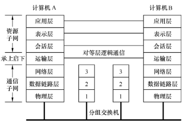

- ISO国际标准化组织，OSI开放系统互连
- 7层模型
  - **物理层physical layer**：关注在一条通信信道上传输原始比特【在物理传输介质上可靠、透明地进行比特位收发】
  - **数据链路层data link layer**：将一个原始的传输设施转变成一条没有漏检传输错误的线路【在相邻节点之间可靠地传输数据帧data frame】
    - 确认帧acknowledgement frame
    - 流量控制flow control：保持快速发送方不会用数据把慢速接收方淹没
    - 介质访问控制子层MAC：如何控制对共享信道的访问
  - **网络层network layer**：【实现通信子网的控制】，把分组从源点传输到目的点
    - 控制路由选择
    - 差错控制
    - 拥塞congestion控制：因为太多的计算机要发送太多的流量，而网络又没有能力传递所有的数据包
  - **运输层transport layer**：接受来自上一层的数据，在必要的时候把这些数据分割成较小的单元，然后把这些数据单元传递给网络层，并且确保这些数据单元正确地到达另一端【为高层用户提供可靠的端到端通信服务】
  - **会话层session layer**：【允许不同机器上的用户建立会话】
    - 对话控制dialog control：记录该由谁来传递数据
    - 令牌管理token management：禁止双方同时执行同一个关键操作
    - 同步功能synchronization：在一个长传输过程中设置一些断点，以便在系统崩溃之后还能恢复到崩溃前的状态继续运行
  - **表示层presentation layer**：表示层以下关注的是如何传递数据位，表示层关注的是所传递信息的语法和语义【为上层用户提供格式转换、编码、压缩、加密等服务】
  - **应用层application layer**：包含了用户通常需要的各种各样的协议【定义应用的框架】
    - 超文本传输协议http：万维网www的基础

### 1.4.7 TCP/IP 参考模型

- 4层模型

  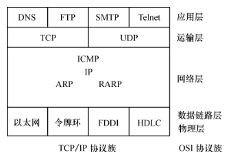

  - **链路层link layer**（网络接口层/主机-网络层）：对应ISO参考模型低两层，支持各种流行的协议，包括局域网和广域网标准。TCP/IP协议主要定义网络层以上的协议。
  - **互联网层Internet layer**：对应ISO参考模型地网络层
    - **ARP(Address Resolution Protocol) 地址解析协议**：将IP地址转换程MAC硬件地址
    - **RARP(Reverse ARP) 反向地址解析协议**
    - **IP(Internet Protocol) 因特网协议**：提供无连接数据报传输和网际路由协议
    - **ICMP(Internet Control Message Protocol) 因特网控制报文协议**：允许主机或路由器报告差错情况和提供有关异常情况的报告
  - **运输层transport layer**：对应ISO参考模型的运输层
    - **TCP(Transmission Control Protocol) 传输控制协议**：建立在IP之上的可靠的面向连接的端到端的通信协议。IP是无连接、不可靠的协议，TCP采用确认、超时重发、流量控制等保证可靠性，但增加了协议开销，也不提供广播或多播服务。
    - **UDP(User Datagram Protocol) 用户数据报协议**：建立在IP之上的无连接的端到端通信协议。不提供可靠性保证机制，增加和扩充了IP的接口能力，传输高效、开销小，协议和协议格式简单。
  - **应用层application layer**：对应ISO参考模型的高层
    - DNS域名服务：提供域名到IP地址的转换
    - FTP文件传输协议：用于主机之间交换文件
    - SMTP简单邮件传输协议：用于邮件服务器之间进行通信
    - SNMP简单网络管理协议
    - Telnet远程终端协议
    - TFTP简单FTP

> ATM 异步传输模式

# 第二章 物理层

## 2.1 基本概念

- 物理层的主要任务描述为确定与传输媒体的接口的一些特性，利用传输介质实现数据传输。

- **机械特性mechanical**：指明接口所用接线器的形状和尺寸、引线数目和排列、固定和锁定装置等等
- **电气特性electrical**：指明在接口电缆的各条线上出现的电压的范围
- **功能特性functional**：指明某条线上出现的某一电平的电压表示何种意义
- **过程特性procedural**：指明对于不同功能的各种可能事件的出现顺序

## 2.2 数据通信基础

### 2.2.1 数据通信基本组成

#### （1）通信系统的三个基本要素

- 信源（源系统）
- 信宿（目的系统）
- 信道（传输系统 / 通信介质）

#### （2）通信系统的组成

- 信源、变换器、信道、反变换器、信宿

### 2.2.2 基本概念

- 数据：运送消息的实体

- 信号：数据的电气或电磁表现

  - **模拟analogous信号**：消息的参数取值连续 e.g. 连续变化的电压、光照强度或声音强度
  - **数字digital信号**：消息的参数取值离散

- 码元：承载信息的基本信号单位，一个码元能够承载信息量的多少是由码元信号所能表示的数据有效值状态个数决定的

- 信道：用来表示向某一个方向传送信息的媒体。一条通信线路往往包含一条发送信道和一条接收信道

- **波特Baud**：信号传输率（调制速率 / 码元速率 / 波特率baud rate / 符号率）的单位，是线路上单位时间内传送的波形个数，即单位时间波形变化的次数

  > 计算

  - 比特率bit rate = 符号率symbol rate × 每个符号的比特数
  - *e.g. 一个符号携带 2 个比特*

- **基带信号**：来自信源的信号，基带传输

- **带通信号**：基带信号经过载波调制后的信号，通带传输

### 2.2.3 奈奎斯特准则和香农定理

- 信道的最大传输率受信道带宽制约

> 计算

- **奈奎斯特Nyquist准则**

  - 无热噪声理想情况下：

  $$
  最大数据速率 = 2H\log_{2}V (bps)
  $$
  - 理想低通信道的最高码元传输速率2H Baud，H为理想低通信道带宽(Hz)

- **香农Shannon公式**

  - 随机热噪声影响下：

$$
最大比特率 = H\log_{2}(1+S/N) （bps）
$$

### 2.2.4 编码与调制

- 编码：数字数据 → 数字信号
- 解码：数字信号 → 数字数据
- **数字调制digital modulation**：比特与代表它们的信号之间的转换过程
- 解调：模拟信号 → 数字数据

#### （1） 基本编码方法

- 数据比特→信号

- **基带传输baseband transmission**：信号的传输占有传输介质上从零到最大值之间的全部频率，而最大频率则取决于信令速率。
  - **归零制**：正脉冲代表1，负脉冲代表0
  - **不归零NRZ**：正电压表示1，负电压表示0
    - 采用NRZ编码每两个比特信号可能在正电压和负电压之间循环。这意味着我们需要至少B/2 Hz的带宽才能获得B bps的比特率——奈奎斯特定理
  - **不归零逆转NRZI**：1定义为信号有跳变，0定义为信号无转变
  - **曼彻斯特Manchester编码**：位周期中心的下跳变代表0，上跳变代表1
  - **差分曼彻斯特编码Differential Manchester**：一位的开始边界有跳变代表0，位边界没有跳变代表1，位周期中心处始终有跳变
  - 曼彻斯特编码产生信号的频率比不归零制高。从自同步能力来看，归零制和不归零制没有自同步能力，而曼彻斯特编码和差分曼彻斯特编码具有自同步能力
    - 自同步能力：从信号波形本身中提取信号时钟频率的能力

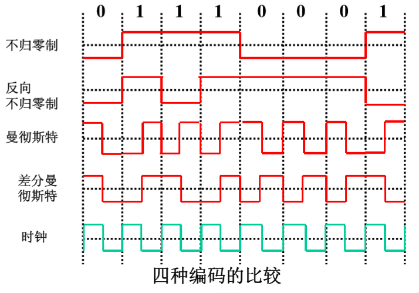

- **通带传输passband transmission**：信号占据了以载波信号频率为中心的一段频带（无线和光纤信道常用）

#### （2）基本调制方法

- 数据比特 → 模拟信号
- 调幅 —— 移幅键控法ASK：调制载波信号的振幅
- 调频 —— 移频键控法FSK：调制载波信号的频率
- 调相 —— 移相键控法PSK：调制载波信号的相位

## 2.3 传输介质

传输介质又称传输媒体，是通信中实际传输信息的载体。

- 磁介质

**有线传输介质**：

- 双绞线twisted pair：
  - 非屏蔽双绞线UTPunshielded twisted pair
  - 屏蔽双绞线STP
  - 两根相互绝缘的铜线组成，两根线绞在一起后，不同电线产生的干扰波会相互抵消，从而能显著降低电线的辐射。因为噪声对两根电线的干扰是相同的， 而它们的电压差却不会改变。
  - 既可以用于传输模拟信号，也可以用于传输数字信号
  - **全双工full-duplex**：可以双向同时使用
  - **半双工half-duplex**：可以双向使用但一次只能使用一个方向
  - **单工simplex**：只允许一个方向上传输
- 同轴电缆coaxial cable：50Ω，75Ω
- 电力线
- 光纤fiber：单模光纤，多模光纤

**无线传输介质**：

- 无线电radio：路径损耗path loss
- 微波
- 红外线
- 卫星

## 2.4 信道复用技术

- **多路复用技术multiplexing**：实现信道的共享
- **脉冲编码调制PCM**：把模拟信号变换成数字信号
  - 步骤：采样、量化、编码

> 分析计算FDM和TDM

- 时分复用TDM：用户在不同的时间占用同样的频带宽度
- 频分复用FDM：用户在同样的时间占用不同的带宽资源
- 波分复用WDM
- 码分复用CMD：码分多址CDMA

# 第三章 数据链路层

## 3.1 数据链路层模型

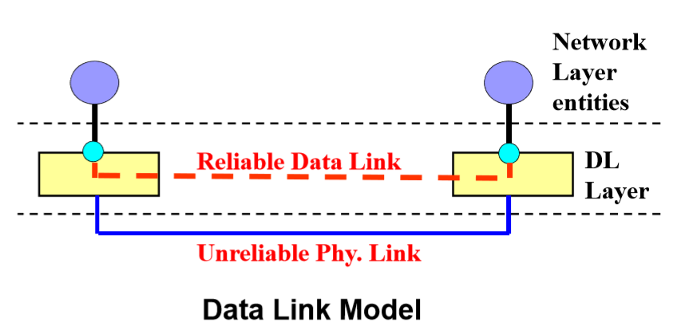

- 链路link：一条无源的点到点的物理线路段，中间没有任何其他的交换结点
- 数据链路data link：若把实现这些协议的硬件和软件加到链路上，就构成了数据链路。当使用复用技术时，一条链路上可以有多条数据链路。
- **数据链路层功能/作用**：为网络层提供服务，使用物理层提供的服务在通信信道上发送和接受比特【在不太可靠的物理链路上实现可靠的数据传输】
  - 向网络层提供一个定义良好的服务接口
  - 处理传输错误【可靠传输数据帧】
  - 调节数据流，确保慢速接收方不会被快速发送方淹没
  - 访问共享信道
- 数据链路层从网络层获得数据包，然后将这些数据包封装成帧frame【帧头、有效载荷payload field（用于存放数据包）、帧尾】以便传输
- 数据链路层使用的信道主要有两种类型：
  - 点对点信道
  - 广播信道

## 3.2 点对点信道数据链路层主要功能

### 3.2.1 成帧

- 数据链路层将比特流拆分成多个离散的帧，为每个帧计算一个称为校验和的短令牌，并将该校验和放在帧中一起传输。当帧到达目标机器时，要重新计算该帧的校验和。如果新算出来的校验和与该帧中包含的校验和不同，则数据链路层知道传输过程中产生了错误，它就会采取措施来处理错误。
- 帧定界方法
  - **字节计数法**：利用头部中的一个字段来标识该帧中的字符数
  - **字节填充的标志字节法**：(只能使用8比特的字节)
    - 每个帧用一些特殊的字节作为开始和结束，这些特殊字节通常都相同，称为**标志字节flag byte**，作为帧的起始和结束分界符。两个连续的标志字节代表了一帧的结束和下一帧的开始。因此，如果接收方丢失了同步，它只需搜索两个标志字节就能找到当前帧的结束和下一帧的开始位置。
    - **字节填充byte stuffing**：发送方的数据链路层在数据中出现的标志字节或转义字节前面插入一个特殊的**转义字节ECS**，接收方的数据链路层在将数据传送给网络层之前必须删除转义字节。
    - PPP协议Point-to-Point Protocol
  - **比特填充的标志比特法**：(帧可以包含由任意大小单元组成的二进制比特数)
    - 每个帧的开始和结束有一个特殊的比特模式，01111110或十六进制0x7E标记，这种模式是一个标志字节。每当发送方的数据链路层在数据中遇到连续五个1，它便自动在输出的比特流中填入一个比特0。这种**比特填充**类似于字节填充，在数据字段的标志字节之前插入一个转义字节到出境字符流中。（USB采用了比特填充技术）
    - HDLC高级数据链路控制协议：同步，透明传输，帧类型
  - **物理层编码违禁法**

### 3.2.2 透明传输

不论要传输的是何种数据，都可以放在帧中进行传输。为此应保证帧的数据部分不会出现帧定界字符或位序列。

* 字符（字节）填充法。插入转义字符。
* 为填充法。0填充法。

### 3.2.3 差错控制

#### （1）比特错误

- 传输的二进制位出现反转

- 差错控制：

  - **纠错码error-correcting code**

    - 发送端：原始信息+冗余信息
    - 接收端：推导出发送的信息
    - 前向纠错FEC
    - 典型：海明码
      - m个消息位和r个校验位，且能纠正所有单个错误
      - （m+r+1）≤ 2^r

  - **检错码error-detecting code**

    - 发送端：原始信息+冗余信息

    - 接收端：接收端知道有错误发生，但不知道是什么错误

    - 奇偶校验码

      > 计算

    - **循环冗余校验码CRC / 多项式编码polynomial code**

      - 生成多项式generator polynomial
        - 下图多项式$x^4+x+1$

      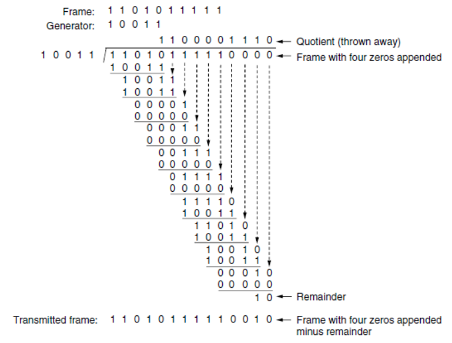

#### （2）传输错误

- 帧丢失
- 帧重复
- 帧失序等

反馈信息 + 计时器 + 给帧分配序号（区分原始帧和重传帧）

### 3.2.4 流量控制与可靠传输机制

> 计算窗口大小、吞吐率、效率、序号等

$效率 = \frac{窗口大小 \times L/R}{RTT + L/R}$

* L：帧大小 bits
* R：信道容量 bits/sec
* RTT：往返传播延时

#### （1）停止-等待式协议stop-and-wait

##### 无错信道

- 发送方首先从网络层获取下一个数据包，用它构造一帧，然后发送出现。
- 发送方在开始下一轮循环从网络层获取下一个数据包之前必须等待，直到确认帧到来。

##### 有错信道

- 增加一个计时器
- 发送方发送一帧，接收方只有在正确接收到数据之后才返回一个确认帧。
- 如果到达接收方的是一个已经损坏的帧，则将它丢弃。
- 经过一段时间之后发送方将超时，于是它再次发送该帧。这个过程不断重复，直至该帧最终完好无损地到达接收方。

#### （2）自动重复请求ARQ / 带有重传的肯定确认PAR

- 区分到达的帧是第一次发来的新帧还是被重传的老帧
- 发送方在它发送的每个帧的头部放上一个序号，接收方可以检查它所接受到的每个帧的序号，由此判断这是个新帧还是应该被丢弃的重复帧。
- 一位序号0/1

#### （3）滑动窗口协议sliding window

- 全双工数据传输
- 机器A到机器B的数据帧与机器B到机器A的确认帧混合在一起，接收方只要检查入境帧头部的kind字段，就可以区别出该帧是数据帧还是确认帧
- **捎带确认piggybacking**：暂时延缓确认以便将确认信息搭载在下一个出境数据帧上的技术
  - 更好的利用了信道的可用带宽
- 本质：在任何时刻发送方总是维持着一组序号，分别对应于允许它发送的帧，我们称这些帧落在发送窗口sending window内。类似的，接收方也维持着一个接收窗口receiving window，对应于一组允许它接受的帧。
- 发送方必须在内存中保存所有帧，以便满足可能的重传需要。因此，如果最大的窗口尺寸为n，则发送方需要n个缓冲区来存放未被确认的帧。如果窗口在某个时候达到了它的最大尺寸，则发送方的数据链路层必须强行关闭网络层，知道有一个缓冲区空闲出来为止。
- 接收方数据链路层的窗口对应于他可以接受的帧。任何落在窗口内的帧被放入接收方的缓冲区。当收到一个帧，且其序号等于窗口下边界时，接收方将它传递给网络层，并将整个窗口向前移动一个位置。在所有情况下，接收方都要生成一个确认并返回给发送方。
- 窗口大小为1意味着数据链路层只能按顺序接收帧，但是对于大一点的窗口，这一条便不再成立。相反，网络层总是按照正确的顺序接收数据，跟数据链路层的窗口大小无关。

##### 回退N协议 go-back-n

- 过长的往返时间对于带宽的利用效率有严重的影响

  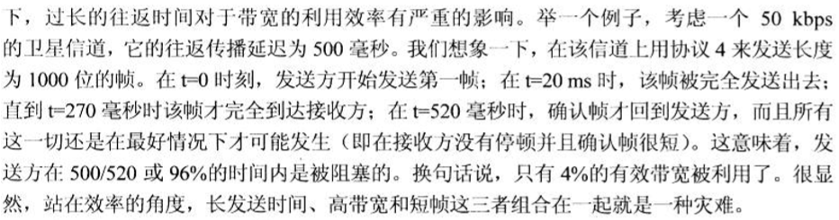

- 基本思想：允许发送方在阻塞之前发送多达w个帧，而不是一个帧。通过选择足够大的w值，发送方就可以连续发送帧，因为在发送窗口被填满之前前面帧的确认就返回了，因而防止了发送方进入阻塞。

- 为了找到一个合适的w值，需要知道在一帧从发送方传播到接收方期间信道上能容纳多少个帧。这个容量由比特/秒的带宽乘以单向传送时间所决定，或数据链路层有责任以链路的**BD带宽-延迟乘积bandwidth-delay product**序列把数据包传递给网络层。

- **最大窗口尺寸 w = 2BD + 1**

- **链路利用率 ≤ w / (2BD + 1)**

- go-back-n：接收方简单丢弃所有到达的后续帧，并且针对这些丢弃的帧不返回确认（对应于窗口大小为1的情形）。如果在计时器超时之前，发送方的窗口已被填满，则管道变为空闲。最终发送方超时，并且按照顺序重传所有未被确认的帧，从那个受损或者被丢失的帧开始。

- **累计确认cumulative acknowledgement**

##### 选择重传协议 selective repeat

- 确保接收方向前移动窗口之后，新窗口与老窗口的序号没有重叠 👉 窗口的最大尺寸应该不超过序号空间的一半，所需要的缓冲区的数量等于窗口的大小而不是序号的范围
- 接收方将收到的坏帧丢弃，但接受并缓存坏帧后面的所有好帧。当发送方超时，它只重传那个最早的未被确认的帧。如果该重传的帧正确到达接收方，接收方就可按需将他缓存的所有帧递交给网络层。选择重传对应的接收方窗口大于1。
- **否定确认NAK**：当接收方检测到错误，就发送一个否定确认NAK，NAK可以触发该帧的重传操作，而不需要等到相应的计时器超时。

### 3.2.5 协议

#### 1) HDLC 高级数据链路控制

* 同步
* 透明传输
* 帧类型
  * 信息帧 Information frame
  * 管理帧 supervisory frame
  * 无编号帧 unnumbered frame

#### 2) PPP 点对点协议

* 要求
  * 简单
  * 封装成帧
  * 透明性：保证数据传输的透明性
  * 多种网络协议：同一条物理链路上同时支持多种网络层协议
  * 多种类型链路：能够在多种类型的链路上运行
  * 差错检测（没有校正
  * 检测连接状态
  * 最大传送单元：对每一种类型的点对点链路设置最大传送单元MTU的标准默认值（至少是1500字节）——分组
  * 网络层地址协商
  * 数据压缩协议
* 不需要的功能
  * 纠错
  * 流量控制
  * 序号
  * 多点线路
  * 半双工或单工链路
* 组成部分
  * 封装：将IP数据报封装到串行链路的方法
  * 链路控制协议（LCP）：用于建立、配置、测试和管理数据链路连接。
  * 网络控制协议（NCP）：协商数据包格式与类型，建立、配置不同的网络层协议

# 第四章 MAC

## 4.1 MAC概念及作用

- LAN使用广播信道 / 多路访问信道multiaccess channel / 随机访问信道random access channel

  - 点到点连接

- **介质（媒体）访问控制MAC子层**：用来确定多路访问信道下一个使用者的协议，属于数据链路层的一个子层

- 如何分配信道
  - 静态分配方案：将时间划分成离散的时间间隔（**时间槽**），并使用轮循算法，每台机器只能在分配给它的时间槽到时广播。当一台机器在分配给它的时间槽到来时没有任何数据发送，就浪费了信道容量。
  - 动态分配方案：按需分配
    - 集中式：中心实体（e.g. 蜂窝网络中的基站）决定接下来谁使用信道
    - 分散式：没有中央实体，每台机器自行决定是否可以传输

## 4.2 无线局域网LAN

- 地理范围和站点数目均有限
- 网络为一个单位所拥有
- 速率很高，差错率很低
- 隐藏终端问题hidden station problem：由于竞争者离得太远而导致站无法检测到潜在的竞争者
- 暴露终端问题exposed station problem
- 简单拓扑结构
  - 星形、总线型、环形、树形、混合

## 4.3 LAN体系结构

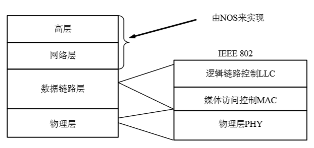

## 4.4 信道共享技术

- 静态划分信道
  - 频分复用
  - 时分复用
  - 波分复用
  - 码分复用
- 动态媒体接入控制（多点接入）
  - 随机接入
    - 典型：CSMA/CD 带有冲突检测的载波侦听多路存取
  - 受控接入
    - e.g. 多点线路探询、轮询

## 4.5 多路访问协议 multi-access protocol

### 4.5.1 ALOHA

#### 纯pure ALOHA*（时间连续）*

- 基本思想：当用户有数据需要发送时就传输。这样会产生冲突，冲突的帧将被损坏。发送方需要某种途径来发现是否发生了冲突。ALOHA系统中，每个站在给中央计算机发送帧之后，该计算机把该帧重新广播给所有站。发送站可以侦听来自集线器的广播，以此确定它的帧是否发送成功。在其他系统中，比如有线局域网中，发送方在发送的同时能侦听到冲突的发生。如果帧被损坏了，则发送方等待一段随机时间然后再次发送该帧。等待时间必须随机，否则同样的帧会一次又一次冲突，因为冲突帧被重发的节奏完全一致。【竞争contention系统】
- 采用统一长度的帧比长度可变的帧更能达到最大的吞吐量
- **帧时frame time**：表示和传输一个标准的、固定长度的帧所需要的时间（帧的长度 / 比特率）

#### 分槽slotted ALOHA*（时间离散）*

- 必须等到下一个时间槽的开始时刻
- 最佳信道利用率1/e

### 4.5.2 载波侦听多路访问协议

- 载波侦听协议carrier sense protocol：协议中站监听是否存在载波（即是否有传输），并据此采取相应的动作。

#### （1）1-坚持载波检测多路访问CSMA

​        当一个站有数据要发送，它首先侦听信道，确定当时是否有其他站正在传输数据；如果信道空闲，就发送数据；否则，如果信道忙，该站等待直至信道变成空闲，然后站发送一帧。如果发生冲突，该站等待一段随机的时间，然后再从头开始上述过程。1-坚持指发现信道空闲时传输数据的概率为1。

#### （2）非坚持nonpersistent CSMA

​        如果信道当前正在使用中，则该站并不持续对信道进行监听，以便传输结束后立即抓住机会发送数据。相反，他会等待一段随机事件，然后重复上述算法。因此该算法将会导致更好的信道利用率，但是比起1-坚持CSMA也带来了更大的延迟。

#### （3）带冲突检测的CSMA（CSMA/CD, CSMA with collision detection）

- 以太网采用的多路访问协议

- 不能进行全双工通信，而只能进行双向交替通信（半双工通信）

- 站点使用CSMA协议进行数据发送，在发送期间如果检测到冲突，立即中止发送，并发出一个瞬间干扰信号，是所有站点都知道发生了冲突，在发出干扰信号后，等待一段随机时间，再重复上述过程。

- 节省时间和带宽

- 检测冲突的最小时间：信号从一个站传播到另一个站所需要的时间

  最坏情况：只有当一个站传输了**2τ**（两倍的端到端往返传播时延）之后还没有监听到冲突，才可以确保自己已经抓住了信道。

- **争用期2τ**，可以把CSMA/CD看成一个分槽ALOHA系统，时间槽宽度为2τ（两倍传播延迟）

- 效率计算：$efficiency = \frac{1}{1+5t_{prop}/t_{trans}}$

  - t_prop：两点传播时延
  - t_trans：传输最大帧时间

#### （4）带冲突避免的CSMA（CSMA/CA, CSMA with collision avoidance）

* 主动**避免冲突**而非被动侦测的方式来解决冲突问题。
* 首先检测信道是否有使用，如果检测出信道空闲，则等待一段随机时间后，才送出数据。
* 接收端如果正确收到此帧，则经过一段时间间隔后，向发送端发送确认帧ACK。 
* 发送端收到ACK帧，确定数据正确传输，在经历一段时间间隔后，再发送数据。

## 4.6 以太网与IEEE 802.3

有线局域网

经典以太网 & 交换式以太网

- 以太网是当前最流行的局域网，采用IEEE 802.3的MAC协议，即CSMA/CD协议。基于HUB或Repeater的以太网是共享式以太网，包含一个冲突域和一个广播域。
- 特性：
  - 传输方式：基带传输
  - 拓扑结构：总线 / 星形（逻辑总线）
  - 传输媒体：
    - 铜缆、铜线（三类以上无屏蔽双绞线）、光缆
  - 速率
    - 传统：
      - 10Base2, 10Base5
      - 10Base_T, 10Base_F
    - 快速：
      - 100Base_T, 100Base_T4
    - 千兆位：1000Base_T
  - 编译与译码：曼彻斯特
- 网卡的功能：实现MAC子层和物理层的功能
  - 数据的封装与解封：组装和译码以太网帧
  - 链路管理：实现CSMA/CD协议

### 4.6.1 经典以太网

- 帧格式：

  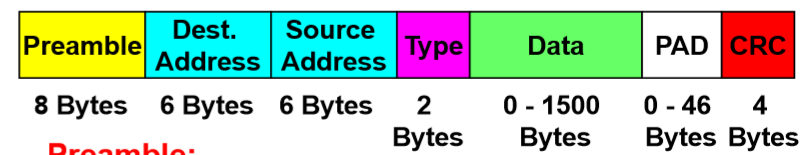

  - **前导码Preamble**：8个字节，每个字节包含比特模式10101010（除了最后一个字节的最后两位为11）。最后一个字节称为802.3的帧起始定界符SOF
  - 如果传输出去的目标地址第一位是0，表示这是一个普通地址；如果是1，表示这是一个组地址。组地址允许多个站同时监听一个地址。当某个帧被发送到一个组地址，该组中的站都要接收它。【组播multicasting】
  - 数据字段Data：最大帧长1500Bytes，最小帧长64Bytes。如果帧的数据部分少于64个字节，则使用填充字段PAD来填充，使其达到最小长度要求。

### 4.6.2 交换式以太网

* 广播域与冲突域
  * 广播域：广播是一种信息的传播方式，指网络中的某一设备同时向网络中所有的其它设备发送数据，这个数据所能广播到的范围即为广播域。
  * 冲突域：一个站点向另一个站点发出信号。除目的站点外，其他站点收到该信号的构成冲突域。

- 交换机switcher：中继与之连接的计算机之间的数据包，根据每个数据包中的地址来确定这个数据包要发送给哪台计算机。
- 端口port：一个交换机有多个端口，每个端口连接一台计算机
- 交换机的工作：中继与之连接的计算机之间的数据包，根据每个数据包中的地址来确定这个数据包要发送给哪台计算机

### 4.6.3 虚拟局域网VLAN

- 把一个物理局域网看成多个逻辑局域网
- 在交换机将各网段分隔为多个不同的、较小的冲突域基础上，进一步分隔为多个不同的、较小的广播域

### 4.6.4 扩展以太网（LAN互连）

#### （1）在物理层扩展以太网

- 使用光纤
- 使用集线器。集线器是一种中继器
  - 每个中继器和网段都增加了时延——中继器数量受到限制
  - 工作在物理层，没有高层信息的隔离作用
  - 一个冲突域

#### （2）在数据链路层扩展以太网

- 使用网桥或交换机，网桥或交换机工作在数据链路层
- 网桥或交换机的作用
  - 匹配不同端口的速度
  - 对帧进行检测和过滤
  - 提高网路的带宽，扩大网络的地理范围
  - 在数据链路层划分网段
- 使用网桥带来的好处：
  - 过滤（隔离）通信量
  - 扩大了物理范围
  - 提高了可靠性
  - 可互连不同物理层、不同MAC子层和不同速率（如10Mb/s和100Mb/s的局域网冲突域
  - 网桥使各网段成为隔离开的冲突域
- 使用网桥带来的坏处：
  - 存储转发增加了时延
  - 具有不同MAC子层的网段桥接在一起时时延更大
  - 在MAC子层并没有流量控制功能
  - 网桥只适合于用户数不太多（不超过几百个）和通信量不太大的局域网，否则有时还会因传播过多的广播信息而产生网络拥塞。这就是所谓的广播风暴。
- 网桥类型：
  - 透明网桥
  - 源路由网桥
  - 交换机：多端口透明网桥，方便实现VLAN

### 4.6.5 网桥算法

- **后向学习法backward learning**
  - 利用混杂模式，通过源地址学习地址和端口的对应关系。
- **生成树网桥**
  - 为了提高可靠性，网桥之间可使用冗余链路。在一对网桥之间并行设置了两条链路。这种设计可确保一条链路宕掉后，网络不会被分成两组计算机，使得它们之间无法通信。然而，冗余链路产生了拓扑环路。
  - 每个网桥遵循着常规的处理规则：对于未知目的地的帧，泛洪该帧到所有其它端口（flooding algorithm）
  - 用一棵可以到达每个网桥的生成树覆盖实际的拓扑结构。实际上，在构造一个虚拟的无环拓扑结构时网桥之间某些潜在的连接被忽略掉了，这个无环拓扑结构是实际拓扑结构的一个子集。
  - 网桥选择具有最低标识符的网桥成为生成树的根，然后构造从根到每个网桥的最短路径树。

### 4.6.6 中继器/集线器/网桥/交换机/路由器和网关

- 之所以存在不同层的问题，是因为不同的设备使用不同的信息来决定如何交换

  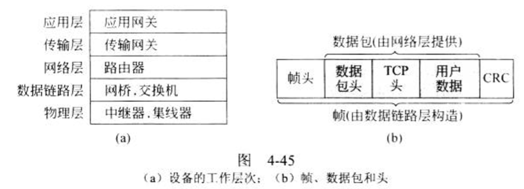

  - 物理层——中继器：连接两个线缆，在一个线缆上出现的信号被清理、放大，然后再被放到另一个线缆上。中继器并不理解帧、数据包或帧头，它们只知道把比特编码成电压的符号。
  - 物理层——集线器：有许多条输入线路，它将这些输入线路连接在一起。从任何一条线路上到达的帧都被发送到所有其他的线路上。如果两帧同时到达，他们将会冲突，就好像它们在同一根同轴电缆上遇到后发生碰撞一样。连接到同一个集线器上的所有线路必须以同样的速度运行。集线器与中继器不同，它们（通常）不会放大入境信号，并且可以有多个输入线路，但是两者之间的差别并不大。都不会检查链路层地址。
  - 数据链路层——网桥：连接两个或多个局域网，一个现代网桥有多个端口。与集线器不同的是网桥的每个端口被隔离成它自己一个冲突域；如果端口是全双工的点到点线路，则需要用到CSMA/CD算法。当到达一帧时，网桥从帧头提取出帧的目的地址，并用该地址查询一张应该把帧发往哪里去的表。
  - 交换机：现代网桥的另一个称呼，常用于连接单独的计算机。

# 第五章 网络层

## 5.1 作用与服务

- 作用：支持实现主机之间的通信

- 交换技术：典型采用分组交换

- 服务：

  - 虚电路virtual circuit服务（面向连接）
  - 数据报datagram服务（无连接）、

- Internet网络层

  最重要的作用

  - 异构网络的互连（在网络层），形成互连网络
  - 屏蔽底层异构网络（物理网络）的差异，实现两台主机之间的通信

  Internet网络层向上只提供简单灵活的、无连接的、尽最大努力交付的数据报服务

## 5.2 功能

### 5.2.1 异构网络互连

- 网络层关注如何将分组从发送主机传输到接收主机
- 在发送端，网络层将报文段封装进数据报，在接收端，网络层向运输层交付报文段。在网络层的每台主机和路由器中都有网络层协议。当IP数据报通过路由器时，路由器检查所有数据报的首部字段。

### 5.2.2 路由与转发

- 路由：决定分组从源到目的地所采用的路由。（全局规划）
- 转发：将分组从路由器的输入移动到适当的路由器输出。（本地动作）
- 转发要通过查找路由器的转发表（路由表）实现，而转发表又要通过路由算法来建立

## 5.3 IP地址

在IPv4中，IP地址为一个32位的二进制数，共2^32台主机。IP地址全世界范围内唯一。每台主机和每个路由器都有一个IP地址，可用在IP数据包的源地址和目标地址字段

* IP地址的结构
  * 层次型结构。区别通过路由器互连的网络，以及网络上的主机。

* 编制方法
  * 分类的IP地址。最基本的编址方式。将地址分为A、B、C、D、E类。
    * A类地址：1.0.0.1-126.255.255.254
      * 私有地址保留：10.0.0.0-10.255.255.255
    * B类地址：128.0.0.1-191.255.255.254
      * 私有地址保留：172.16.0.0-172.31.255.255
    * C类地址：192.0.0.1-223.255.255.254
      * 私有地址保留：192.168.0.0-192.168.255.255
    * D类地址：224.0.0.0-239.255.255.255 用于组播
    * E类地址：240- 研究用
  * 子网划分subnetting。对最基本的编制方法的改进。
    * 子网掩码：子网掩码是一个32位的2进制数，其对应网络地址的所有位置都为1，对应于主机地址的所有位置都为0
  * 无类别IP地址（CIDR地址，或超网supernetting）
    * CIDR使用“斜线记法”，又称为CIDR记法。
    * 一个CIDR地址块可以表示很多地址，这种地址的聚合称为**路由聚合**，它使得路由表中的一个项目可以表示很多个原来传统分类地址的路由。如128.14.32.0/20表示的地址块共有$2^{12}$个地址。
* 特点
  * IP地址管理机构在分配IP地址时只分配网络号，而剩下的主机号则由得到该网络号的单位自行分配。这样方便了IP地址的管理。
  * 路由器仅根据目的主机所连接的网络号来转发分许（而不考虑目的主机号），这样就可以使路由表中的项目数大幅度减少，从而减小了路由表所占的存储空间
  * 实际上IP地址使标志一台主机（或路由器）和一条链路的接口
  * 当一个主机同时连接到两个网络上时，该主机就必须同时具有两个相应的IP地址，其网络号net-id必须是不同的。这种主机称为多接口主机（multihomed host）。
  * 由于一个路由器至少应当连接到两个网络（这样它才能将IP数据报从一个网络转发到另一个网络），因此一个路由器至少应当有两个不同的IP地址
  * 用中继器、网桥或交换机连起来的若干个LAN仍为一个网络，因此这些LAN都具有相同的网络ID
  * 所有分配到网络号net-id的网络，不论是范围很小的局域网，还是可能覆盖很大地理范围的广域网，都是平等的
* 子网掩码 subnet mask
  * 使用子网掩码可以找出IP地址中的子网部分
  * 子网掩码就是将网络地址部分和子网地址部分全部置为1，而主机地址部分置为0，所以 $(IP地址) AND (子网掩码) = 网络地址$
* 最长前缀匹配
  * 使用CIDR时，路由表中的每个项目由“网络前缀”和“下一跳地址”组成。在查找路由表时可能会得到不止一个匹配结果。应当从匹配结果中选择具有最长网络前缀的路由：最长前缀匹配（longest-prefix matching）。最长前缀匹配又称为最长匹配或最佳匹配。网络前缀越长，其地址块就越小，因而路由就越具体。
* 路由聚合
  * CIDR支持路由聚合，很多优点，广泛使用。
  * 聚合方法 -> 子网划分计算掩码

## 5.4 IP协议

* IP分组分段
* IP分组的路由和转发

## 5.5 ARP、ICMP、DHCP

### 5.5.1 ARP 地址解析协议

- ARP实现IP地址到MAC地址的转换
- proxy ARP ARP代理
- ARP本地缓存，若无映射则广播，收到回复添加映射。接收方在收到请求时也添加发送方映射。

### 5.5.2 ICMP Internet控制报文协议

* ICMP允许主机或路由器报告差错情况和提供有关异常情况的报告。
* 发送出错报文到发送原数据的设备上，只报告问题不纠正错误。
* Ping命令即检查网络状态。
* 跟踪路由的Tracert命令也是基于ICMP协议的

### 5.5.3 DHCP 动态主机配置协议

* DHCP允许一台主机自动获取一个IP地址，同时还获得其他信息，如子网掩码、默认网关（即第一跳路由器地址）以及本地DNS服务器地址。
* 实现过程：
  * Client广播Discover包，目的是想发现能够给它提供IP的Server。 
  *  Server接收到Discover包之后，通过发送Offer包给予Client应答。
  * Client接收到Offer包之后，发送Request包请求分配IP。 
  * Server发送ACK数据包，确认信息。

## 5.6 路由选择算法

### 5.6.1 非适应型（静态）

* Flooding，最短路径搜索

### 5.6.2 适应型（动态）

* 集中式
* 分布式
  * 距离向量（DV）算法
  * 链路状态（LS）算法
* 距离向量（DV）算法
  * 基于Bellman-Ford方程。
  * 设$d_x(y)$表示从x到y最低费用路径的费用，$c(x,v)$表示从x到其邻居v的费用，则$d_x(y)=min\{c(x,v)+d_v(y)\}$，其中min针对x的所有邻居。
  * 基本思想：每个结点周期性地向它的邻居发送自己的距离向量（估计值）DV，当结点x接收到来自邻居地新DV估计时，它使用B-F方程更新其自己的DV。在规模较小、正常地条件下，估计值$D_x(y)$将收敛在实际最小费用$d_x(y)$。
  * 路由更新规则：
    * 发现了一条到未知新主机的最短路由
    * 发现了一条到已知主机的距离更短的新路由
    * 到已知主机的原有路由的距离发生了变化
* 链路状态（LS）算法
  * 五个步骤
    * 发现邻居并了解它们的网络地址
    * 为每个邻居设置距离或成本度量
    * 构造一个包，包括所有学到的信息
    * 将这个包发送给所有其他路由，同时也接收它们发来的包
    * 计算到达其他路由器的最短路径
  * 拓扑结构数据库
  * Dijkstra算法

## 5.7 Internet路由选择协议

### 5.7.1 自治系统AS

* 网络中的路由器要通过路由协议来进行选路，但由于规模和管理的原因，众多的路由器不可能运行相同的路由协议。因此需要将某区域的路由器聚合起来，称之为“自治系统（AS）”。
* 一般来说，一个AS总是由同一个管理者或管理机构来进行管理的，管理者可以根据自己的测略来决定AS内部的所有事情，包括采用的路由算法。

### 5.7.2 Internet路由选择协议

- 两级：
  - 域内路由：在AS内部的路由器所运行的路由协议
  - 域间路由：在AS之间的路由器所运行的路由协议
  - 路由表由AS内部和AS之间的路由算法所配置。
- 两大类：
  - 内部网关协议IGP：在一个自治系统内部使用的路由选择协议。目前这类路由选择协议使用最多，如RIP和OSPF（开放式最短路径优先）协议。
  - 外部网关协议EGP：若源站和目的站处在不同的自治系统中，当数据报传到一个自治系统的边界时，就需要使用一种协议将路由选择信息传递到另一个自治系统中。这样的协议就是外部网关协议EGP。在外部网关协议中目前使用最多的是BGP-4。

### 5.7.3 RIP路由信息协议

* 基本特点
  * RIP是一种分布式的、基于距离向量算法（DV）的路由选择协议。
  * RIP协议中的“距离”也称为**“跳数”（hop count）**，因为每经过一个路由器跳数+1
  * 好的路由通过的路由器数目少，即“距离短”
  * **允许一条路径最多只能包含15个路由器，“距离”最大值为16时即相当于不可达**，所以RIP只适用于小型互联网
  * 每隔30s交换一次路由信息运行在UDP之上
* 要点：
  - 一个路由器仅和相邻路由器交换信息。
  - 交换的信息是当前本路由器所知道的全部信息，即自己的整个路由表。
  - 按固定的时间间隔交换路由信息，例如每隔30秒。

### 5.7.4 OSPF 开方式最短路径优先

* 基本特点
  * “开放”表明OSPF协议不是受某一家厂商控制，而是公开发表的。
  * “最短路径优先”是因为使用了Dijkstra提出的最短路径算法SPF。
  * 分布式的链路状态协议。采用链路状态算法。
  * 基于IP。
  * OSPF划分为两种不同的区域（层次通信）
    * 主干区域（backbone area，记area 0）。主干区域的作用是用来连通其他在下层的区域（区域之间的通信必须通过area 0）。
    * 区域
* 要点
  * 向本自治系统中所有路由器发送信息，这里使用的方法是可靠的洪范法。
    * 发送的信息就是与本路由器相邻的所有路由器的链路状态，但这只是路由器所知道的部分信息。
  * “链路状态”就是说明本路由器都和哪些路由器相邻，以及该链路的“度量”（metric）。
  * 只有当链路状态发生变化时，路由器才用洪泛法向所有路由器发送此信息。

### 5.7.5 BGP 边界网关协议

* BGP是不同自治系统的路由之间交换路由信息的协议。
* BGP只能是力求寻找一条能够到达目的网络且比较好的路由（不能兜圈子），而并非要寻找一条最佳路由。
* 采用路径向量算法（与距离向量算法相似）。
* 基于TCP。

## 5.8 IPv6

* 地址及其记法
  * 地址长度为128位，是IPv4地址长度的4倍。
  * 记法：
    * 冒分十六进制表示法：格式为X:X:X:X:X:X:X:X，其中每个X表示地址中的16b，十六进制表示，每个X的前导0可省略。
    * 0位压缩表示法：可以把连续的一段0压缩为“::”。为保证地址唯一性，只压缩最长连续段。
* 特点
  * 更大地址空间
  * 减小路由表大小
  * 简化协议
  * 更好的安全性
  * 注意服务类型
  * 援助多播
  * 漫游主机不改变地址
  * 允许未来协议演进
  * 允许新旧协议共存
* IPv4到IPv6的过度
  * 隧道：IPv4路由器可以将IPv6数据报封装入IPv4数据报的数据字段。

# 第六章 传输层

## 6.1 作用于服务

传输层也称运输层。

- 作用：支持实现进程之间（或端到端）的通信，屏蔽下面网络的差异。运输层为应用进程之间提供端到端的逻辑通信（网络层是为主机之间提供逻辑通信）。
- 服务：面向连接 & 无连接
- 运输层是整个协议体系的中心，执行运输层功能的软件或硬件称为运输实体。运输层实体可以放在操作系统内核中，也可以放在一个单独的用户进程中。
- 运输服务由两个运输实体之间的运输协议实现。

## 6.2 Internet运输层协议

### 6.2.1 用户数据报协议UDP

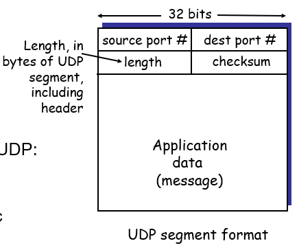

- 无连接协议，提供无连接服务，传送数据之前不需要先建立连接
- 传送的数据单位协议是UDP报文或用户数据报
- 对方的运输层在收到UDP报文后，不需要给出任何确认
- 虽然UDP不提供可靠交付，但在某些情况下UDP是一种最有效的工作方式

### 6.2.2 传输控制协议TCP

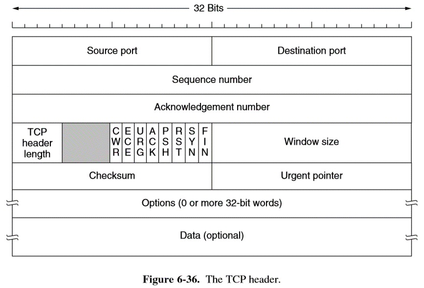

- 面向连接的协议，提供面向连接的服务
- 传送的数据单位协议是TCP报文段（segment）
- TCP不提供广播或多播服务
- 由于TCP要提供可靠的、面向连接的运输服务，因此不可避免增加了许多开销。这不仅使协议数据单元的首部增大很多，还要占用许多的处理机资源。

### 6.2.3 运输层端口

- 端口：TSAP（传输服务访问点）称为端口，用于区分应用层的不同进程，端口号用16位来标识。由ICANN确定的端口称为知名端口，如HTTP用80，SMTP用25，Telnet用23等。由操作系统分配给请求通信的客户进程或用户应用进程自行选定的端口称为一般端口。
- 传输层寻址：对于由网络层提交上来的报文段，传输层根据报文段首部的目的端口号将报文提交给相应的应用进程

## 6.3 TCP连接管理

- 连接建立：3次握手。报文顺序：SYN，SYN-ACK，ACK
- 连接释放：非对称。报文顺序：FIN，ACK

### 6.3.1 建立连接

- 三次握手three-way handshake
  - TCP使用三次握手机制来建立连接
  - TCP连接是全双工的
  - 进行连接建立的TCP双方通过交换3个报文段来同步顺序号。握手中的第1个报文段中的SYN位置为1，第2个报文段将SYN位和ACK位都置为1，表明它应答第一个SYN同时继续握手过程，最后一个握手报文段仅仅一个应答ACK，用以通知目的地双方一致认为连接已经建立。

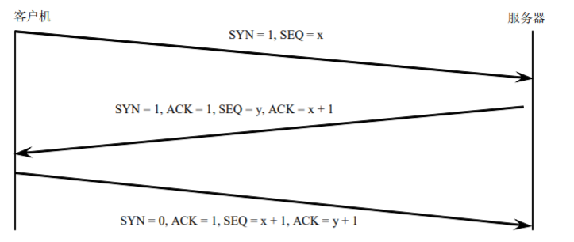

### 6.3.2 释放连接

* 数据传输完成后，使用TCP进行通信的两个程序需要断开连接。
* TCP采用非对称释放，即每个方向单独释放。

## 6.4 TCP可靠传输

- TCP使用序号、确认、超时和重传等完成差错控制，实现可靠传输
- TCP在IP不可靠服务的基础上创建可靠数据传输服务，实现可靠传输的关键字段是首部的序号和确认号字段。TCP以流水线方式发送报文段，使用单个重传计时器，采取累计确认的方式，超时事件和重复ACK事件都会触发重传。

### 6.4.1 序号

- TCP对每个方向上传送的每个数据字节都进行编号
- 每个方向上的编号相互独立
- 建立连接时，双方商定初始序号（不一定从0开始）
- TCP为每个报文段指派一个编号，报文段的序号就是报文段中的第一个数据字节的序号。

### 6.4.2 确认ACK

- 每一方使用确认号对已经接受的字节表示确认
- 确认号定义了期望接收的下一个字节的序号。例如：确认号=1001，表示1000之前的数据字节都正确接收，期望接收从1001开始的数据字节。
- 接收方采用累计确认的方式。即不必对收到的报文段逐个发送确认，二hi对按序到达的最后一个正确报文段发送确认，这样就表示：到这个报文段为止的所有报文段都已正确收到了。

### 6.4.3 重传超时定时器

* 重传机制是TCP中最重要和最复杂的问题之一。
* TCP每发送一个报文段，就对这个报文段设置一次计时器。
* 如果在超时前该数据段被确认，就关闭该定时器，否则，一旦超过则重发该报文段。

## 6.5 TCP流量控制

- TCP使用滑动窗口协议完成流量控制：接收方在报文段接收窗口字段中通告其接收缓冲区的剩余空间，这样就可以使发送方限制其未确认的数据不能超过接收窗口所通告的大小，从而保证接收缓冲区不溢出。
  - 以字节为单位的滑动窗口
  - TCP连接的每一端都必须设置两个窗口：
    - 一个发送窗口
    - 一个接收窗口
  - TCP两端的四个窗口经常处于动态变化中
  - 糊涂窗口综合征：一次只发送1个字节

## 6.6 TCP拥塞控制

- TCP使用滑动窗口协议完成拥塞控制

### 6.6.1 网络拥塞

- 拥塞congestion：在某段时间，若对网络中某资源的需求超过了该资源所能提供的可用部分，网络的性能就要变坏，这种现象称为拥塞。
  - 若网络中有许多资源同时产生，网络的性能就要变坏，整个网络的吞吐量将随输入负荷的增大而下降。
- 出现拥塞的原因：对资源需求的总和 > 可用资源
- 拥塞控制与流量控制区别
  - 流量控制往往指在给定发送端和接收端之间点对点通信量的控制。
  - 流量控制所要做的就是抑制发送端发送数据的速率，以便使接收端来得及接收。

### 6.6.2 拥塞控制方法

* TCP拥塞检测
  * TCP发送方感知网络发生拥塞的方式有两种：
    * 发生超时事件
    * 收到三个重复的ACK
  * 当感知到拥塞时，TCP发送方通过减小拥塞窗口来降低发送方的发送速率。

- TCP的拥塞控制机制：
  - 控制参数：拥塞窗口 + 域值
  - 拥塞检测：隐式反馈 = 由发送方自己检测
    - 报文丢失
    - 3个重复的ACK（用于FR/FR）
  - 控制策略或方法：AIMD（加性增乘性减）。
    - 加性增：如果没有检测到丢包事件（超时或3个重复的ACK），则在每个RTT时间拥塞窗口值增加一个MSS（最大报文段长度）
    - 乘性减：检测到丢包事件后，拥塞窗口值减半。
  - 控制阶段：2个
    - 慢启动（SS）：在连接开始时，拥塞窗口值设为最小（1个MSS），然后TCP以指数形式增加拥塞窗口大小，直到域值。
    - 拥塞避免（CA）：达到域值之后，线性增加拥塞窗口大小。
  - 优化机制
    - 快速重传（FR）+快速恢复（FR）
      - 当收到3个重复的ACK后，说明网络还具有一定的传送报文段的能力，因此拥塞窗口值减半，然后再线性增加。
      - 但是超时事件以后，TCP将拥塞窗口值降为1个MSS，然后窗口再指数增长，当达到域值（新域值为发生丢包以前的拥塞窗口值的一半）后，再线性增长。

# 第七章 应用层

## 7.1 网络应用模型

### 7.1.1 客户机/服务器模型

* 在客户机/服务器模型中，有一个总是打开的主机称为服务器，它服务于来自许多其他称为客户机的主机的请求。客户机主机既可能有时打开，也可能总是打开。
* 在客户机/服务器模型中，客户机相互之间不直接通信。
* 客户机/服务器模型的另一个重要特点是服务器具有固定的、周知的 IP 地址。由于服务器具有固定的地址且总是打开的，所以客户机总能够通过向服务器的地址发送分组来与其联系。

### 7.1.2 P2P模型

* 在P2P模型中，应用程序中没有一个总是打开的服务器，任意一对主机（称为对等方）间都可以直接相互通信，参与的主机每当加入时都有可能改变其 IP 地址。 
* P2P模型的最大特点是它具有高度可扩展性， 每个参与的对等方增加需求的同时也增加了服务能力。 

## 7.2 DNS（域名系统服务协议）系统

### 7.2.1 层次域名空间

* Internet 的域名结构是倒立的树，在最上面的是根，但没有对应的名字，树根下面一级的结点就是顶级域结点，在顶级域结点下面的是二级域结点，最下面的叶结点就是单台计算机。

### 7.2.2 域名服务器

* DNS 系统使用了大量的 DNS 服务器（域名服务器） ，它们以层次方式组织，并且分布在全世界范围内。简单来说，有 3 种类型的 DNS 服务器： 
  * 根DNS服务器
  * 顶级域服务器：负责顶级域名（如 com、org、net、edu 和 gov 等）和所有国家的顶级域名（如 uk、fr、ca 和 jp 等 ）。 
  * 权威 DNS 服务器：在 Internet 上具有公共可访问主机的每个组织机构必须提供公共可访问的 DNS 记录，这些记录将这些主机的名字映射为 IP 地址，由组织机构的权威域名服务器负责保存这些 DNS 记录。
* 此外，还有一类重要的 DNS 服务器，称为本地 DNS 服务器。本地 DNS 服务器相当于是一个代理，当主机发出 DNS 请求时，该请求被发往本地 DNS 服务器，本地 DNS 服务器将该请求转发到 DNS 服务器层次结构中。

### 7.2.3 域名解析过程

* 解析方式：递归式、迭代式。
  * 迭代式：本地DNS服务器发送多条查询
  * 递归式：每个DNS服务器向下一个进行查询，收到后返回。
* 当某一个应用进程需要将主机名解析为 IP 地址时，该应用进程就成为 DNS 的一个客户，它将待解析的域名放在 DNS 请求报文中，以 UDP 数据报方式发给本地 DNS 服务器。本地 DNS 服务器在查找到域名后，将对应的 IP 地址放在回答报文中返回，应用进程获得目的主机的 IP 地址后即可进行通信。
* 如果本地 DNS 服务器不能回答该请求， 则它会向层次结构中的其他 DNS 服务器迭代地发出查询请求，该过程直到本地 DNS 服务器找到能够回答该请求的 DNS 服务器为止，最后，本地DNS 服务器将对应的 IP 地址放在回答报文中返回。 应用进程获得目的主机 IP 地址后就可进行通信。 

## 7.3 FTP （文件传输协议）

### 7.3.1 FTP工作原理

* FTP 采用客户机/服务器工作方式， 一个 FTP 服务器进程可以同时为多个客户进程提供服务。
* FTP 的服务器进程由负责接受新请求的主进程和若干负责处理单个请求的从属进程组成。
* 主进程的工作步骤：
  * 打开知名端口（端口号为 21） ，等待客户进程发出连接请求。
  * 启动从属进程处理客户进程发出的请求，从属进程处理完客户进程发来的请求后便终止。
  * 主进程回到等待状态，继续接受其他客户进程发来的请求。主进程与从属进程的处理是并发进行的。 

### 7.3.2 控制连接与数据连接

- FTP使用两个并行的TCP连接来传输文件，一个是控制连接，一个是数据连接。
  - 控制连接：用于在两主机之间传输控制信息，诸如用户标识、口令、改变远程目录命令以及发往“put”和"get"文件命令。对应服务器端口号为21。控制连接贯穿于整个用户会话期间
  - 数据连接：用于准确地传输一个文件，数据连接是非持久的，即针对会话中的每一次文件传输都需要建立一个新的数据连接，对应的服务器端口号是20。
- 因为FTP使用一个分离的控制连接，所以也称FTP的控制信息是“带外”传送的。

## 7.4 Email 电子邮件

### 7.4.1 电子邮件系统的组成结构

* 电子邮件系统具有 3 个主要组成部件：
  * 用户代理：是用户与电子邮件系统的接口，具有撰写、显示和处理功能。
  * 邮件传输代理（e.g. 邮件服务器） ：是电子邮件系统的核心组件，其功能是发送和接邮件，并向发件人报告邮件传送情况。
  * 邮件使用协议：邮件服务需要使用两个不同的协议，一个是 SMTP，用于发送邮件； 另一个是 POP3，用于读取邮件。

### 7.4.2 SMTP和POP3

#### 7.4.2.1 SMTP （简单邮件传输协议）

* 通信过程分为 3 个阶段。 
  * 连接建立：发信人将要发送的邮件送到邮件缓存。SMTP 客户定时对邮件缓存扫描一次。若发现有邮件，则发送端主机的 SMTP 客户通过知名端口号（25）与目的主机的SMTP 服务器建立 TCP 连接。在连接建立后，SMTP 服务器发出服务就绪指令。接着SMTP 客户向 SMTP 服务器发送 HELLO 命令，附上发送方主机名，SMTP 服务器若有能力接收邮件，则回答“250 OK”（表示已准备接收） ，并附上接收方的主机名；否则，回答“421 Service not available” （表示服务不可用） 。如果在一定时间内（如 3 天）发送不了邮件，则将邮件退还发信人。 
  * 邮件传送： 发送主机的 SMTP 客户发 MAIL 命令， 命令后面还有发信人的地址， 若 SMTP服务器已准备好邮件，则回答“250 OK” ；否则，返回一个代码指出原因，如“451”（表示处理时出错） 。为了知道接收端系统是否已做好接收邮件的准备，发送主机的SMTP 客户根据同一个邮件是发送给一个或多个收信人，发一个或多个“RCPT TO：<收信人地址>” 。每发送一个命令，SMTP 服务器都返回相应的信息，如“250 OK”（表示邮箱在接收端的系统中）或“550 no such user here”（表示无此用户） 。SMTP 客户发DATA 命令，表示要开始传送邮件内容了，内容发送完毕就发送“<Ctrl+F>·<Ctrl+F>”表示邮件内容结束。
  * 连接释放：SMTP 客户发送 QUIT 命令，SMTP 服务器返回“221”（服务器关闭）表示同意释放 TCP 连接。邮件传送过程结束。

#### 7.4.2.2 POP3 （邮局协议版本3）

* POP3 使用客户机/服务器的工作方式，在接收邮件的用户 PC 中运行 POP3 客户程序，而在用户所连接的 ISP 的邮件服务器中则运行 POP3 服务器程序。 
* 当用户上网连接成功后，运行 POP3 客户程序，并与所连接的 ISP 邮件服务器的 POP3 服务器程序建立 TCP 连接，在用户输入鉴别信息（用户名和口令）后，就可以对邮箱进行读取。 

## 7.5 WWW 万维网

### 7.5.1 WWW的概念与组成结构

* 万维网（WWW）并非某种特殊的计算机网络，而是一个大规模的、联机式的信息储藏所， 英文简称为 Web。
* 每个 Web 页都是由对象组成的，对象可以是 HTML 文件、JPEG 图片、Java 小程序或音频文件等。每个 Web 页都包含有基本的 HTML 文件，基本的 HTML 文件包括了几个引用对象。
*  WWW 使用统一资源定位符（URL）来标识分布在整个 Internet 上的万维网文档， 使用 HTTP 来实现万维网上的各种链接，使用超文本标记语言 HTML 使不同风格的万维网文档能在 Internet 上的各计算机上显示出来，使用搜索工具使用户能够很方便地找到所需的信息。

### 7.5.2 HTTP

* HTTP 是 Web 的应用层协议，它采用客户机/服务器模式，使用 TCP 进行传输，知名端口号为80。 
* 工作过程：
  * 客户发起建立 TCP 连接； 
  * 客户发送 HTTP 请求； 
  * 服务器返回 HTTP 响应； 
  * 释放此次 TCP 连接。 
* HTTP 连接分为非持久 HTTP 和持久 HTTP。 
  * 非持久 HTTP：经过一个 TCP 连接至多发送一个对象。 
  * 对于持久 HTTP：多个对象能够经过客户机和服务器之间的单个 TCP 连接来发送。 
* HTTP 报文有两类：请求报文和响应报文。
  * 请求报文的格式分为 3 部分： 请求行， 首部行和实体主体。 请求行中的方法可以有 GET、POST、HEAD、PUT、DELETE 等。
    * GET：从服务器获取数据（给的少拿的多）
    * POST：向服务器推送数据（给的多拿的少）
    * DELETE：删除服务器的一些内容
    * PUT：向服务器存放一些内容
    * HEAD：只请求页面的头部
    * TRACE（或OPTIONS）：发送一个探测性请求，如果返回了信息说明建立了连接
  * 响应报文的格式也分为 3 部分：状态行，首部行和实体主体。
* HTTP 是无状态的协议， 即服务器不保留有关客户机过去请求的任何信息。 如果想要保存客户的历史访问信息，就需要用到 Cookie 机制。

### 7.5.3 Web Proxy

* 缓存经常访问的资源。 